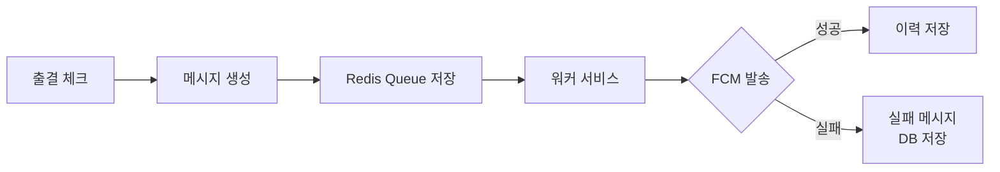
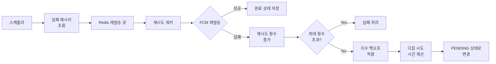
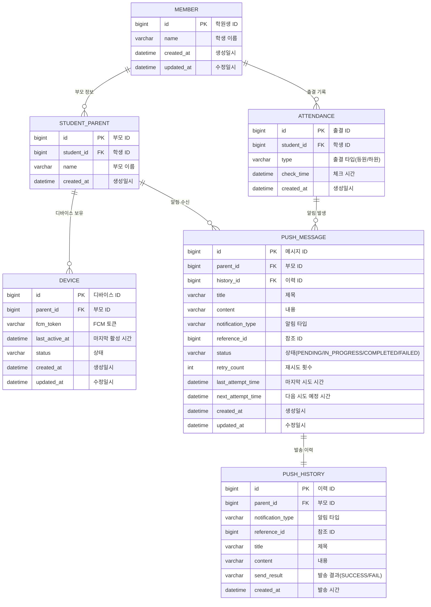

# 푸시 알림 서비스 개선

## 📋 프로젝트 배경
### 기존 서비스의 문제점

1. 출결 처리 시 학부모 대상 푸시 알림 미전송 문제 발생
    - 최대 동시 요청 200~300명 상황에서 간헐적 실패
2. 로깅 시스템 부재로 인한 원인 파악 불가
    - 프로그램 자체 오류인지 Firebase 문제인지 구분 불가

### 문제 원인 분석

1. Firebase 서버 상태에 따른 메시지 전송 지연/실패
2. 대량 메시지 전송 시 처리 속도 및 제한 사항
3. 디바이스 토큰 관리 문제
    - 주기적 토큰 갱신으로 인한 최신 토큰 유지 어려움
    - 앱 삭제/재설치 시 토큰 정리 미흡
    
### 개선 목표

1. 커스텀 로깅 시스템 구축
2. Redis를 활용한 비동기 메시지 처리
3. 메시지 재전송 로직 구현
4. 전송 현황 모니터링 시스템 구축

## 📤 메시지 처리 프로세스

### 1. 실시간 푸시 발송 프로세스


__처리과정__
1. 출결 체크 발생
2. 푸시 메시지 생성 및 Redis Queue에 저장
3. 워커가 실시간으로 메시지 처리
4. 성공 시 이력 테이블에 저장
5. 실패 시 재처리를 위해 DB에 저장

### 2. 실패 메시지 재처리 프로세스


__처리과정__
1. 스케줄러가 30초마다 PENDING 상태의 메시지 중 nextAttemptTime이 현재 시간보다 이전인 메시지 조회
2. 조회된 메시지 ID를 Redis 재발송 큐(push-queue:retry)로 발행
3. 재시도 워커가 메시지를 수신하여 처리
4. FCM으로 메시지 재발송 시도
5. 성공 시 COMPLETED 상태로 변경
6. 실패 시
   - 재시도 횟수 증가
   - 최대 재시도 횟수(5회) 초과 시 FAILED 상태로 변경
   - 초과하지 않은 경우
     - 지수 백오프 알고리즘 적용하여 다음 시도 시간 계산
     - PENDING 상태로 변경하여 다음 스케줄링 대기

### 3. 재시도 메커니즘 설계 결정 이유

재시도 메커니즘은 DB와 스케줄러를 기반으로 설계되었으며, 이러한 결정에 대한 이유

1. **Redis Pub/Sub의 한계**
   - Redis의 발행-구독 메커니즘은 메시지 영속성을 보장하지 않음
   - 구독자가 없거나 연결이 끊긴 상태에서는 메시지가 완전히 소실됨
   - 시스템 장애 시 메시지 복구 불가능

2. **안정성 우선**
   - 메시지 전송의 신뢰성이 최우선 요구사항
   - DB를 통한 영속성 계층으로 메시지 손실 방지
   - 시스템 재시작이나 장애 발생 시에도 재시도 정보 유지

3. **부하 관리**
   - 스케줄러 기반 처리로 시스템 부하 분산
   - 지수 백오프 전략으로 재시도 간격 점진적 증가
   - 대량 메시지 동시 재시도 시 서버 과부하 방지

4. **유연한 재시도 정책**
   - 재시도 횟수, 간격, 백오프 전략 등을 유연하게 조정 가능
   - 메시지 상태 추적 및 모니터링 용이

### 4. 지수 백오프 전략
```
baseDelay = 10초
maxDelay = 600초 (10분)
delay = min(maxDelay, 2^retryCount * baseDelay)
```

재시도 간격
- 1차 재시도: 10초 후
- 2차 재시도: 20초 후
- 3차 재시도: 40초 후
- 4차 재시도: 80초 후
- 5차 재시도: 160초 후

지수 백오프 전략을 선택한 이유
- **서버 부하 분산**: 재시도 간격을 점진적으로 늘려 서버 부하를 시간적으로 분산
- **일시적 장애 대응**: 초기에는 짧은 간격으로 재시도하여 빠르게 복구되는 상황에 대응, 문제가 지속될 경우 점진적으로 간격 증가
- **자원 효율성**: 지속적인 문제 상황에서 불필요한 재시도로 인한 자원 낭비 방지
- **과도한 재시도 방지**: 짧은 간격의 연속적인 재시도로 인한 "thundering herd" 문제 방지
- **최대 지연 시간 설정**: 무한정 지연되지 않도록 최대 지연 시간(600초) 설정

### 5. 장기간 미처리 메시지 관리
- 매일 자정에 스케줄러가 실행
- 24시간 이상 경과된 PENDING, IN_PROGRESS 메시지를 FAILED로 처리
- 시스템 안정성 유지 및 리소스 효율적 관리

## 🛠 기술 스택
- Java 17
- Spring Boot 3.4
- Spring Data JPA
- Spring Data Redis
- Firebase Admin SDK
- MariaDB
- H2 Database (테스트용)
- Prometheus & Grafana (모니터링)

## 📦 프로젝트 구조
```
com.example.push
├── domain                 # 도메인 계층
│   ├── device             # 디바이스 관리
│   │   ├── entity         # 엔티티
│   │   ├── repository     # 저장소
│   │   ├── service        # 서비스
│   │   ├── controller     # 컨트롤러
│   │   └── exception      # 예외
│   ├── message            # 메시지 관리
│   │   ├── entity
│   │   ├── repository
│   │   ├── service
│   │   └── exception
│   ├── notification       # 알림 관리
│   │   ├── entity
│   │   ├── repository
│   │   ├── service
│   │   ├── scheduler      # 재시도 스케줄러
│   │   └── dto            # 데이터 전송 객체
│   ├── metrics            # 모니터링 메트릭
│   │   ├── config         # 메트릭 설정
│   │   ├── service        # 메트릭 서비스
│   │   └── scheduler      # 메트릭 수집 스케줄러
│   └── attendance         # 출결 관리
│       ├── entity
│       ├── repository
│       ├── service
│       └── controller
├── global                 # 공통 모듈
│   ├── common             # 공통 클래스
│   │   ├── BaseEntity     # 기본 엔티티
│   │   └── BaseResponse   # 기본 응답
│   ├── config             # 설정
│   │   ├── AsyncConfig    # 비동기 설정
│   │   ├── RedisConfig    # Redis 설정
│   │   ├── ScheduleConfig # 스케줄러 설정
│   │   └── FcmConfig      # Firebase 설정
│   └── error              # 오류 처리
│       ├── code           # 에러 코드
│       ├── exception      # 예외 클래스
│       ├── handler        # 예외 처리기
│       └── response       # 에러 응답
└── infra                  # 외부 인프라
    ├── fcm                # Firebase 연동
    │   └── FcmService     # FCM 서비스
    └── redis              # Redis 연동
        ├── PushMessagePublisher   # 메시지 발행
        ├── PushMessageSubscriber  # 메시지 구독
        ├── RedisTemplateManager # Redis 관리자
        └── RetryPushMessageSubscriber # 재시도 메시지 구독
```

## 🔧 주요 기능
1. 푸시 메시지 관리
    - 비동기 메시지 큐를 통한 처리
    - 지수 백오프 기반 재시도 로직
    - 최신 디바이스 토큰 조회
    - 메시지 상태 추적 및 모니터링

2. 예외 처리
    - 상세한 로깅 시스템
    - 메시지 상태 추적 (PENDING, IN_PROGRESS, COMPLETED, FAILED)
    - FirebaseMessagingException 분류 및 처리
    - 토큰 유효성 검사 및 관리

3. 성능 최적화
    - Redis를 활용한 메시지 큐 구현
    - ThreadPoolTaskExecutor를 통한 비동기 처리
    - 커스텀 스레드 풀 설정 (CPU 코어 수 기반)
    - 시스템 부하 분산을 위한 지수 백오프 전략

4. 모니터링 시스템
    - Prometheus를 통한 메트릭 수집
    - Grafana를 통한 데이터 시각화
    - 주요 지표 실시간 모니터링
      - 푸시 요청 수 및 성공/실패율
      - 재시도 현황 및 성공률
      - 메시지 처리 시간
      - 시스템 리소스 사용량

## 💾 데이터베이스 구조


## 📊 성능 개선 결과 (개선 전 데이터는 없음)
- 동시 200명 요청 처리시 성공률: 99.9%
- 평균 메시지 전송 소요시간: 120ms
- 장애 복구 시간: 평균 5분 이내(재시도 간격 계산)

## 🔒 보안 및 안정성
- FCM 토큰 관리 보안 강화
- 에러 발생 시 즉각적인 로깅 및 알림
- 지수 백오프를 통한 시스템 부하 관리
- 24시간 이상 미처리 메시지 자동 정리
- 모니터링 시스템을 통한 실시간 상태 확인

## 🚀 향후 개선 계획
1. **Message Queue 고도화**
   - Redis Streams 또는 전용 메시지 큐 시스템(RabbitMQ, Kafka) 검토
   - 더 나은 메시지 영속성 및 재전송 메커니즘 구현

2. **실시간 모니터링 강화**
   - 알림 임계값 설정 및 자동 알림
   - 시스템 성능 예측 분석 기능

3. **메시지 발송 대시보드 개발**
   - 관리자용 메시지 발송 현황 대시보드
   - 실패 메시지 수동 재시도 기능
