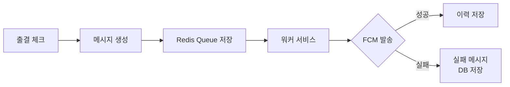
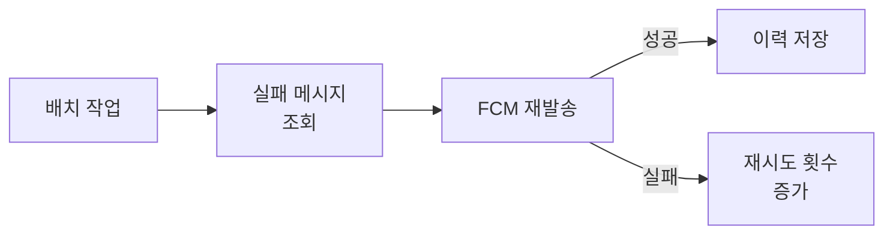
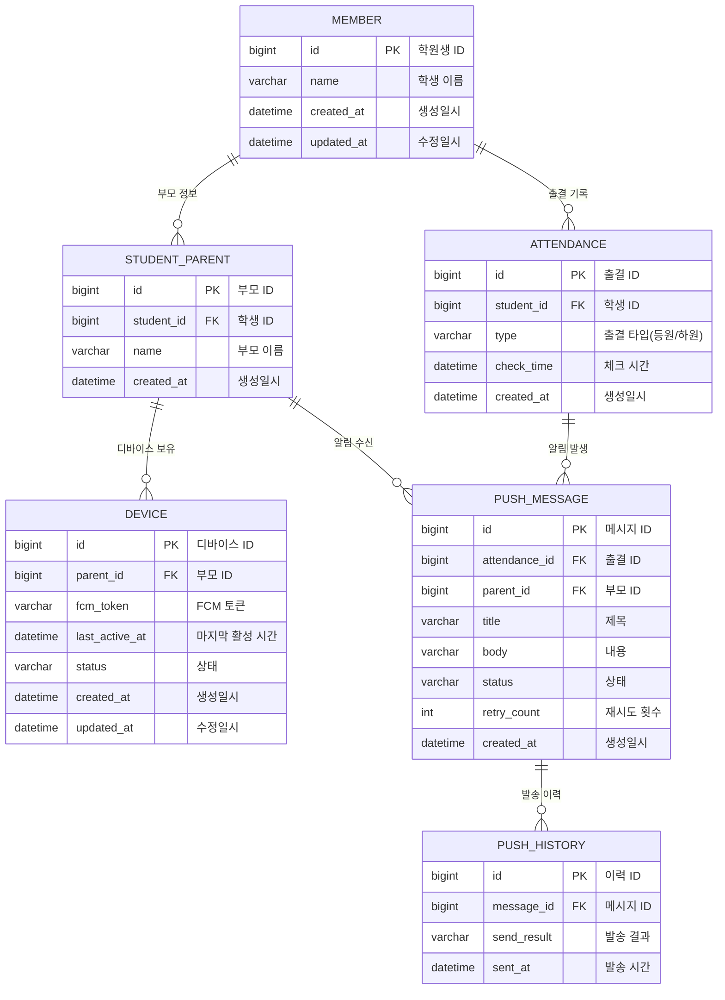

# 푸시 알림 서비스 개선

## 📋 프로젝트 배경
### 기존 서비스의 문제점

1. 출결 처리 시 학부모 대상 푸시 알림 미전송 문제 발생
    - 최대 동시 요청 200~300명 상황에서 간헐적 실패
2. 로깅 시스템 부재로 인한 원인 파악 불가
    - 프로그램 자체 오류인지 Firebase 문제인지 구분 불가

### 문제 원인 분석

1. Firebase 서버 상태에 따른 메시지 전송 지연/실패
2. 대량 메시지 전송 시 처리 속도 및 제한 사항
3. 디바이스 토큰 관리 문제
    - 주기적 토큰 갱신으로 인한 최신 토큰 유지 어려움
    - 앱 삭제/재설치 시 토큰 정리 미흡
    
### 개선 목표

1. 커스텀 로깅 시스템 구축
2. Spring Batch를 활용한 처리 속도 개선
3. 메시지 재전송 로직 구현
4. 전송 현황 모니터링 시스템 구축
5. 효율적인 토큰 관리 시스템 구축

## 📤 메시지 처리 프로세스

### 1. 실시간 푸시 발송 프로세스


__처리과정__
1. 출결 체크 발생
2. 푸시 메시지 생성 및 Redis Queue에 저장
3. 워커가 실시간으로 메시지 처리
4. 성공 시 이력 테이블에 저장
5. 실패 시 재처리를 위해 DB에 저장

### 2. 실패 메시지 재처리 프로세스


__처리과정__
1. 정해진 주기로 실패 메시지 조회
2. FCM으로 재발송 시도
3. 성공 시 이력 저장 및 실패 메시지 삭제
4. 실패 시 재시도 횟수 증가 (최대 재시도 횟수까지)

## 🛠 기술 스택
- Java 17
- Spring Boot 3.4
- Spring Data JPA
- Spring Batch
- Spring Data Redis
- Firebase Admin SDK
- MariaDB
- H2 Database (테스트용)

## 📦 프로젝트 구조
```
com.example.push
├── domain                 # 도메인 계층
│   ├── device             # 디바이스 관리
│   │   ├── entity         # 엔티티
│   │   ├── repository     # 저장소
│   │   ├── service        # 서비스
│   │   ├── controller     # 컨트롤러
│   │   └── exception      # 예외
│   ├── message            # 메시지 관리
│   │   ├── entity
│   │   ├── repository
│   │   ├── service
│   │   └── exception
│   └── batch              # 배치 작업
│       ├── job
│       └── step
├── global                 # 공통 모듈
│   ├── common             # 공통 클래스
│   │   ├── BaseEntity     # 기본 엔티티
│   │   └── BaseResponse   # 기본 응답
│   ├── config             # 설정
│   │   ├── BatchConfig    # 배치 설정
│   │   ├── JpaConfig      # JPA 설정
│   │   └── RedisConfig    # Redis 설정
│   └── error              # 오류 처리
│       ├── code           # 에러 코드
│       ├── exception      # 예외 클래스
│       ├── handler        # 예외 처리기
│       └── response       # 에러 응답
└── infra                  # 외부 인프라
    └── fcm                # Firebase 연동
```

## 🔧 주요 기능
1. 푸시 메시지 관리
    - 토큰 관리
    - 배치 처리를 통한 메시지 발송
    - 메시지 재시도 로직
    - 발송 상태 추적

2. 예외 처리
    - 사용자 정의 예외 계층 구조
    - 전역 예외 처리
    - 상세 로깅

3. 성능 최적화
    - Redis를 활용한 메시지 큐 구현
    - 배치 처리
    - 비동기 메시지 처리

## 💾 데이터베이스 구조
